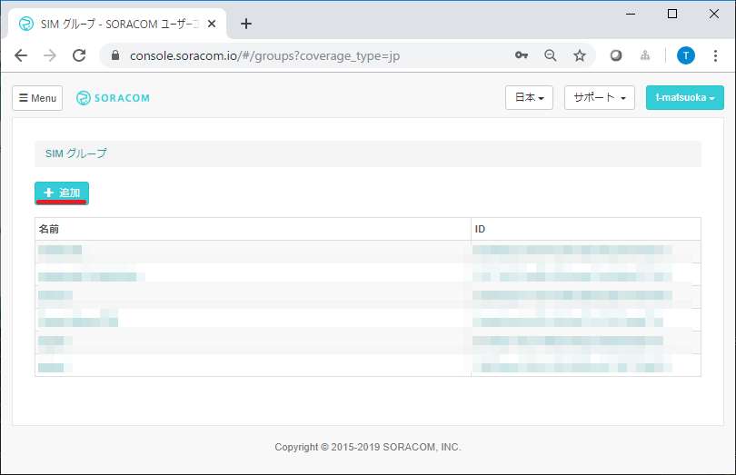
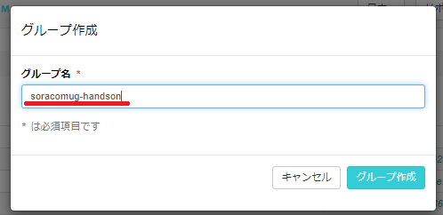
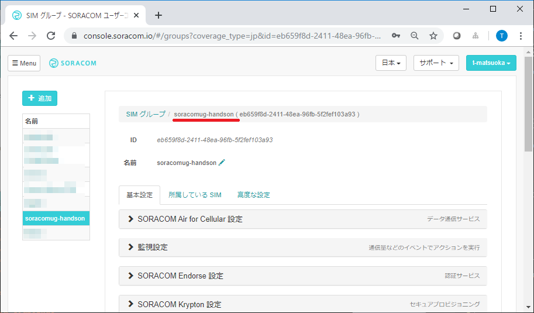
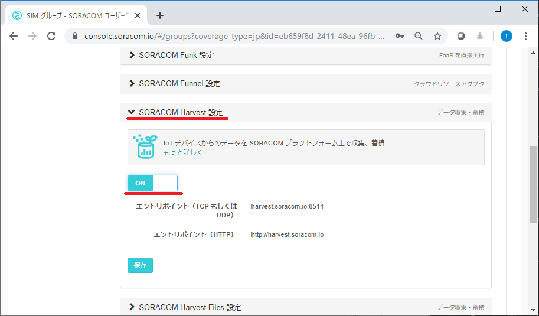

# SORACOM UG Explorer 2019

## WioLTE初級 WioLTEと絶対圧センサーを触って体験するハンズオン

## 本日の機材
各自の机の上に、本日必要な機材を用意しています。
* パソコン(お持ち込み品)
    * 事前に案内済みの [セットアップ](setup) が完了していること
* 有効なSORACOMアカウント（まだの方は作成ください）
    * [ソラコムアカウントの作り方](https://dev.soracom.io/jp/start/console/#account)
* SORACOM Air SIM 
    * [SIMの登録情報](https://dev.soracom.io/jp/start/console/#registsim)
* [Grove IoT スターターキット for SORACOM](https://soracom.jp/products/#grovestarter_kit)
* [絶対圧センサ](https://www.switch-science.com/catalog/5329/)

## ハンズオン前の準備

### SORACOM Air SIMを利用するための準備

このハンズオンではSORACOM　Air SIMを使い、ソラコムのサービスを利用します。そのために、有効なSORACOMアカウントと、配布したSORACOM Air SIMのアクティベーションが必要です。

1. 有効なSORACOM アカウントをお持ちでない方は以下のページを参考にアカウントを作成してください。
    * [ソラコムアカウントの作り方](https://dev.soracom.io/jp/start/console/#account)

2. 配布したSORACOM Air SIMカードを１で作成したアカウントを用いてアクティベーションしてください。
    * [SIMの登録情報](https://dev.soracom.io/jp/start/console/#registsim)

### DFUモードへの切り替え方

Wio LTE は２つのモードを持っています。  
**この操作は Wio LTE の開発で何度も行うことになりますので、必ず覚えてください**

* 書き込まれたプログラムを実行する「通常モード」
* プログラムを書き込むことができる「DFUモード」（Device Firmware Upgradeモード）

「通常モード」の Wio LTE に対して、下記操作を行います

1. *BOOTボタン* を押し、 **押し続けてください**
2. *RSTボタン* を押し、離します
3. 押し続けていた *BOOTボタン* を離します

DFUモードへの移行方法  
※動画ではmicroUSB接続をしていませんが、実際は接続した状態で行ってください

外観からはどちらのモードで動いているのか判別できません。PC のデバイスマネージャ（もしくはシステム情報）で確認することができます。  
確認方法は[DFU モードの確認の仕方](setup#dfu2)を参照してください。

 
 ***

## 絶対圧センサの値をSORACOM Harvestで可視化しよう！

### 1. 配線
I2C 端子に 絶対圧センサーを取りつけます。さらに、WioLTEへアンテナを取り付けてください。

### 2. Wio LTEにスケッチ例を書き込む

下記の「スケッチ書き込みページをページをクリックし、手順に沿って書き込みを行ってください。

[スケッチ書き込みページ](webdfu/)   
[https://masato-ka.github.com/explorer2019-handson/handson1/webdfu](webdfu/)

Connect ボタンを押し、**STM32 BOOTLOADER**を選択して「接続」をクリックします。

「対応デバイスが見つかりませんでした」 が一覧に表示された場合は Wio LTE が DFU モードになっていません。 DFU モードへの移行操作をしてください。

「【絶対圧センサ】を書き込む」をクリックして、スケッチ例を書き込みます。

書き込みが完了したら、WioLTEのリセットスイッチを押して、DFUモードを終了します。

書き込んだコードを知りたい方はこちらをクリックください。

[絶対圧センサ読み取りコード](/sketch/baro-harvest.ino)

ここまでで、デバイス側の準備が完了しました。

### 3. SIMにSIMグループを割り当てる

ここからはSORACOMユーザーコンソールを使ってSIMの設定を行なっていきます。

ソラコムのアカウントにログインしてSORACOMユーザコンソールを表示します。

[アカウントログインページ](https://console.soracom.io/#/?coverage_type=jp)  
[https://console.soracom.io/#/?coverage_type=jp](https://console.soracom.io/#/?coverage_type=jp)

SORACOMユーザーコンソールで、`Menu > SIMグループ`を選択して、`+追加`をクリックしてください。

グループ名を「soracomug-handson」にして、`グループ作成`をクリックしてください。

作成したグループが表示されれば成功です。

(TODO:SIMにSIMグループを割り当て)

### 4. SIMグループのSORACOM Harvestを有効にする

「soracomug-handson」SIMグループのSORACOM Harvest設定を「ON」にして、`保存`をクリックしてください。

### 5. SORACOM Harvest の確認

SIMを選択し、「操作」からデータを確認を選びます。

SORACOM Harvet Dataの画面が開きます。しばらく待つと絶対圧センサーの値がグラフになって表示されます。
絶対圧センサの高さを変えて、気圧の変化を計測しましょう。

## 片付け
これでハンズオンは終了です。最後まで終わった方は、センサーを外し元あった場所にお戻しください。