# SORACOM LTE-M Enterprise Buttonで位置情報を通知するハンズオン

## 概要

本ハンズオンでは以下の内容を作成します。

- Enterprise Button のクリックされた位置とクリック種別（シングルクリック、ダブルクリック、長押し）を SORACOM Harvest で可視化する
- Enterprise Button のクリックされた位置の情報を SORACOM Funk 経由でLINEに通知する (URLをクリックすると地図が表示される) 

### アーキテクチャ

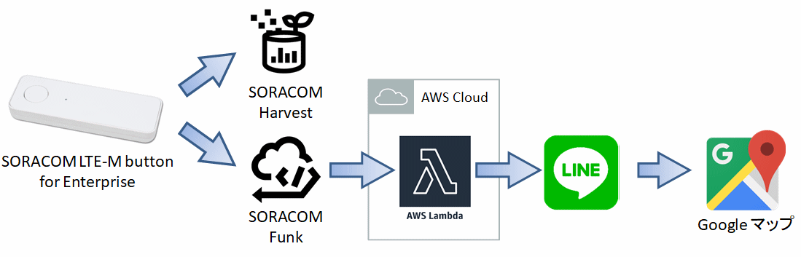

### 必要なもの

このドキュメントを進めるにあたり以下のデバイスが必要となります。

- SORACOM LTE-M Button for Enterprise (本ハンズオンではソラコムからの貸与となります)

このドキュメントを進めるにあたり以下のアカウントが必要となります。

- SORACOM (本ハンズオンではソラコムからの貸与となります)
- AWS
- LINE

このドキュメントを進めるにあたり以下の知識が必要となります。

- AWS Lambda (Pythonのサンプルコード、モジュールは準備済)

## Harvest に Enterprise Button の位置情報とクリックタイプを保存する

Enterprise Button をクリックした際に SORACOM Harvest に対して位置情報とクリックタイプを保存する方法を解説します。

### ■ ユーザーコンソールへログインする

[SORACOM ユーザーコンソール(SAMユーザログイン)](https://console.soracom.io/#/sam_login?coverage_type=jp) へアクセスします。SAMユーザのログイン画面が表示されるので、ボタンに付属しているカードに記載されているオペレータIDとユーザ名、パスワードを入力し、 [ログイン] ボタンをクリックしてください。  


以下のような「SIM 管理」画面が表示されたらログイン完了です。  


### ■ グループを作成し、Enterprise Button を所属させる

1. [ユーザーコンソール](https://console.soracom.io) の "Menu" から "SIM グループ" を選択します。  
   
   

2. "グループを作成する" (グループが存在しない場合) あるいは "追加" ボタンよりグループを作成します。任意の名前 (たとえば "handson-button") をつけて "グループ作成" ボタンをクリックします。  
   

3. "Menu" から "SIM 管理" を選択します。  
   

4. Enterprise Button の SIM の左端にある チェックボックスを選択し、"操作" => "所属グループ変更" を選択します。  
   

5. "新しい所属グループ" に作成したグループを選択し、"グループ変更" をクリックします。  
   

### ■ Harvest の利用を開始する

1. 所属させたグループの名前をクリックし、グループ設定の変更画面に遷移します。  
   

2. ”SORACOM Harvest 設定" を開き、"OFF" となっているスイッチをクリックして "ON" に変更します。"保存" をクリックすれば、Harvest が有効となります。ポップアップされる注意事項では "OK" をクリックします。**"保存" をクリックしないと設定が変更されないのでご注意ください。**  
   

### ■ 簡易位置測位機能の利用を開始する

"SORACOM Air for Cellular 設定" を開き、"簡易位置測位機能" を "ON" に変更し、"保存" をクリックします。  
   

### ■ バイナリパーサー を設定する

"SORACOM Air for Cellular 設定" を開き、"バイナリパーサー設定" を "ON" に変更し、フォーマットに `@button` と記載し、"保存" をクリックします。  
   

### ■ Enterprise Button を押して Harvest を確認する

いよいよ Enterprise Button を押します。ボタンをクリックし、 LED がオレンジ色となり、数秒後に緑色となればデータの送信は成功です。  


Harvest 上のデータを以下の手順で確認します。

1. "Menu" から "SIM 管理" を選択します。  
   

2. Enterprise Button の SIM の左端にある チェックボックスを選択し、"操作" => "データを確認" を選択します。  
   

3. "データ" 列にて、"clickTypeName" が "SINGLE" であることを確認します。  
   

4. マップピンアイコンを選択することで表示を地図に変更して、位置情報を確認します。左上の "+" や "-" でズームを調整できます。"データ" にも `$metadata.location` オブジェクトとしてで位置情報が入っています。  
   

5. Enterprise Button は以下 3 種類のクリックに対応しています。それぞれぜひ試してみてください。連続してデータの送信をしたい場合は Harvest の画面にて「自動更新」を "ON" にしてみてください。  
   - シングル: 短く(1.2 秒未満) 1 回押す
   - ダブル: 2 秒以内にシングルクリックを 2 回行う
   - ロング: 1.2 秒以上押し続ける。


## 位置情報とクリックタイプを SORACOM Funk 経由で LINE に通知する

Enterprise Button から SORACOM Funk と AWS Lambda を介して クリックされた位置の情報とクリックタイプを LINE へ通知する方法を解説します。

### ■ LINE Notifyを設定する

1. [LINE Notify](https://notify-bot.line.me/ja/) を開きます。 

2. 右上の `ログイン` をクリックしLINE IDでログインします。 

3. ログイン後、マイページを開きます。 
   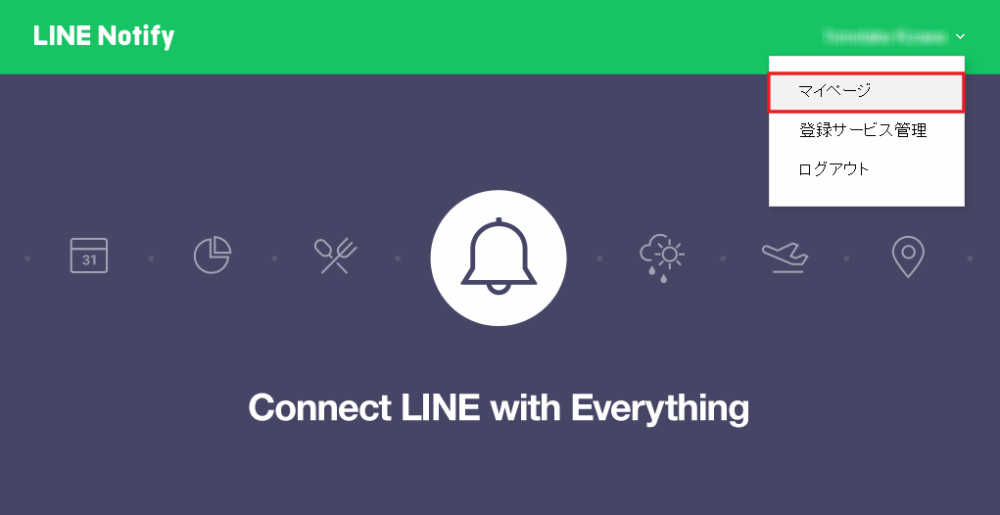

4. 下の方にある `アクセストークンの発行（開発者向け）` の `トークンを発行する` をクリックします。
   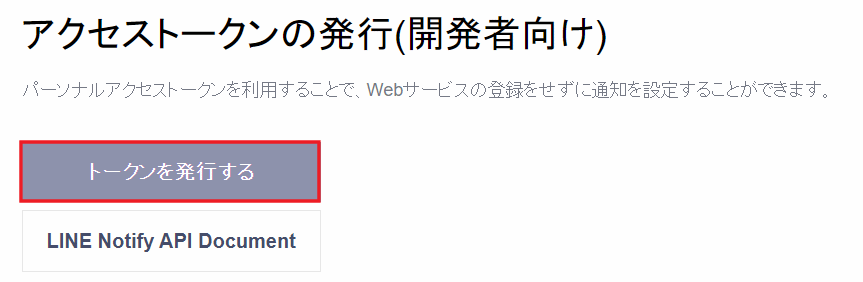

5. ダイアログが開きます。トークン名に任意の名称を記入、 `1:1でLINE Notifyから通知を受け取る` を選択し `発行する` をクリックします
   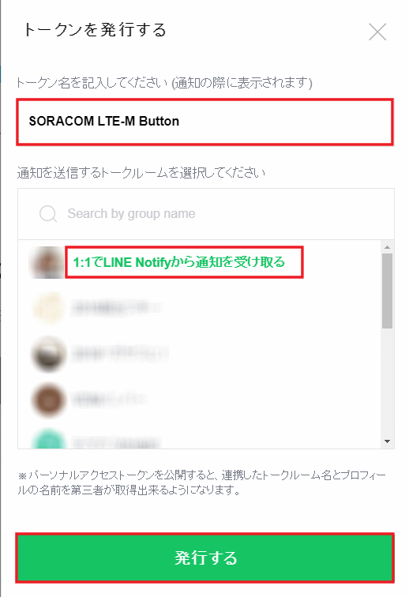

6. トークンが発行されます。 `コピー` をクリックしトークンの文字列をメモしておきます。（後で利用します）
   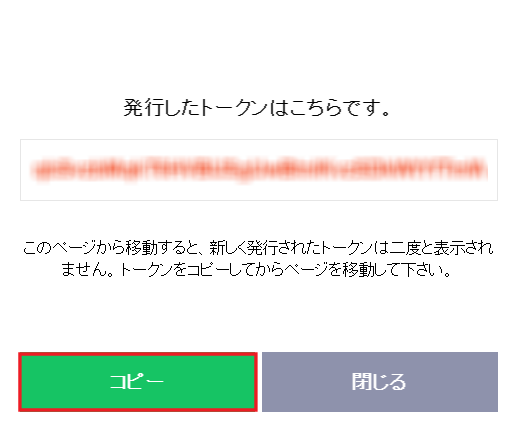

### ■ AWS Lambda を設定する

1. [実行モジュール一式](./handson2.zip)をダウンロードし保存しておきます。

2. [AWS Lambda 管理コンソール](https://ap-northeast-1.console.aws.amazon.com/lambda/home?region=ap-northeast-1#/create) を開きます。

3. 下記の画面が表示された場合は `関数の作成` をクリックします。
   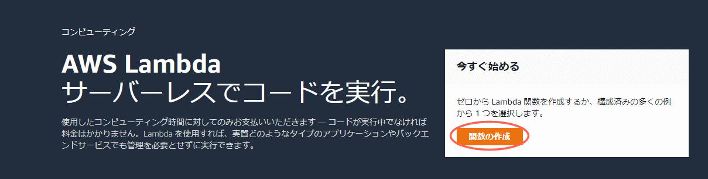

4. 作成方法は `１から作成` を選択します。
続けて任意の関数名をつけ、ランタイムに `Python 3.7` を選択、実行ロールに `基本的な Lambda アクセス権限で新しいロールを作成` とし `関数の作成` を選択します。  
   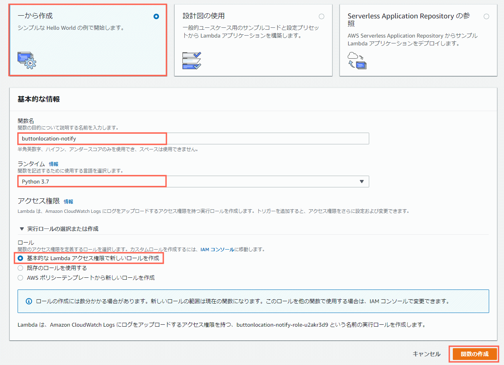

5. 関数が作成されました。関数の編集画面が開きますので、
   コードエントリタイプに `.zipファイルをアップロード` を選択、関数パッケージの `アップロード` をクリックし先程ダウンロードしたモジュールをアップロードします。
   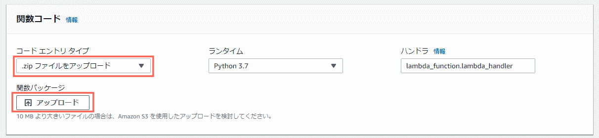

6. 環境変数 `line_token` に先ほど取得した LINE Notify の トークンを入力して、画面一番上の `保存` をクリックします。  
   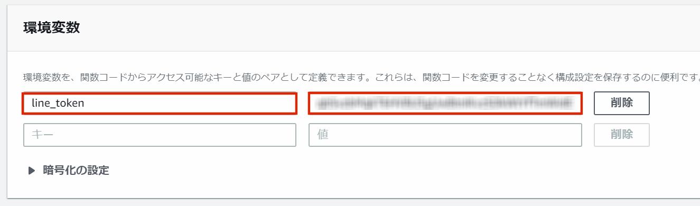

7. Lambda の ARN をコピーしてメモ帳などに写しておきます。
   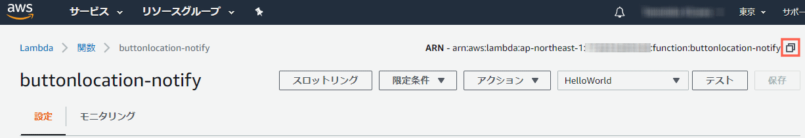

#### (参考) ソースコード

以下のコードが表示されます。

````python
import os
import requests
import json

def lambda_handler(event, context):
    # 環境変数取得
    line_token = os.environ['line_token']

    # 位置情報取得
    try:
        location_lat = context.client_context.custom["location"]["lat"]
        location_lon = context.client_context.custom["location"]["lon"]
    except:
        return 1

    # メッセージ生成
    message = "ボタンが押されました。\nおおよその位置：緯度:" + str(location_lat) + " 緯度:" + str(location_lon) + "\n https://www.google.com/maps/search/?api=1&query=" + str(location_lat) + "," + str(location_lon)

    # LINE Notify呼び出し
    data = push_line(line_token,message)
    response = json.loads(data)
    result = 0 if response['status'] == 200 else 1
    return result

def push_line(line_notify_token,message):
    line_notify_url   = 'https://notify-api.line.me/api/notify'
    payload = {'message': message }
    headers = {'Authorization': 'Bearer ' + line_notify_token}
    line_notify = requests.post(line_notify_url, data=payload, headers=headers).text
    return line_notify
````

### ■ Lambda 実行用の AWS IAM ユーザーを作成する

作成したLambda関数にSORACOM Funkからアクセスできるよう、IAMユーザを作成し権限を付与します。

#### IAMポリシーの作成

1. [IAM管理コンソール](https://ap-northeast-1.console.aws.amazon.com/iam/home) を開き、続けて `ポリシーの作成` をクリックします。
     

2. ポリシーの作成画面でJSONを選択し、以下の内容を入力します。Resourceには先程コピーしたLambdaのARNを入力します。入力が終わったら `ポリシーの確認` をクリックします。

   ```json
   {
     "Version": "2012-10-17",
     "Statement": [
       {
         "Sid": "AllowAuroraToExampleFunction",
         "Effect": "Allow",
         "Action": "lambda:InvokeFunction",
         "Resource": "先ほどコピーしたLambdaのARN"
       }
     ]
   }
   ```

     

3. 続いてポリシー名を入力し、ポリシーの作成ボタンをクリックします。
   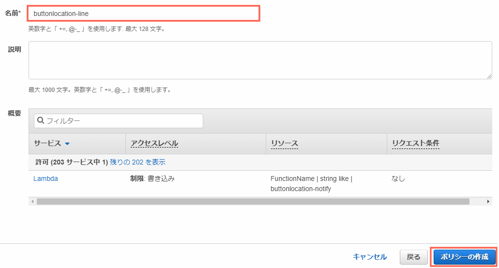  

#### IAMユーザの作成

作成したIAMポリシーをアタッチしたユーザを作成します。

1. 左側メニューのユーザを選択し、`ユーザを追加` ボタンをクリックします。
   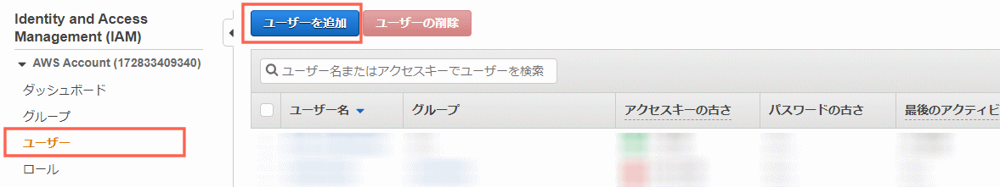

2. 作成画面が開きますので、ユーザ名を入力、`プログラムによるアクセス` を選択し次のステップに進みます。
   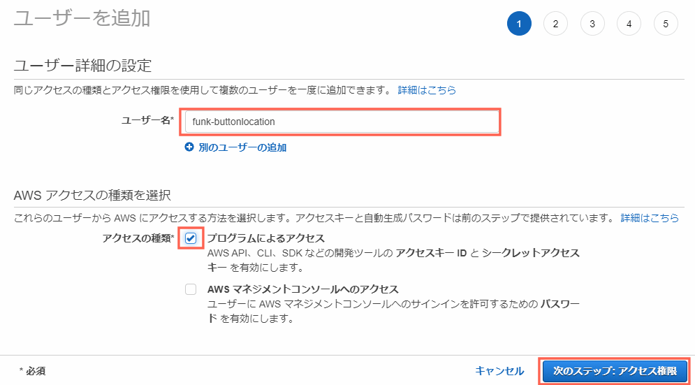

3. アクセス許可の設定を行います。 `既存のポリシーを直接アタッチ` を選択し、先程作成したポリシー名を選択し紐付けます。
   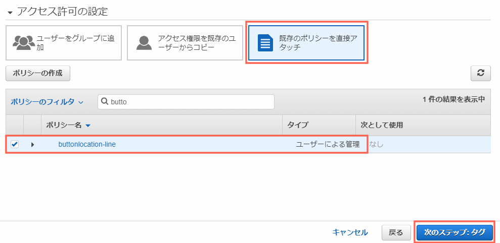

4. タグは不要です。続けて `確認` をクリックします。

5. 確認画面で `ユーザの作成` をクリックします。
   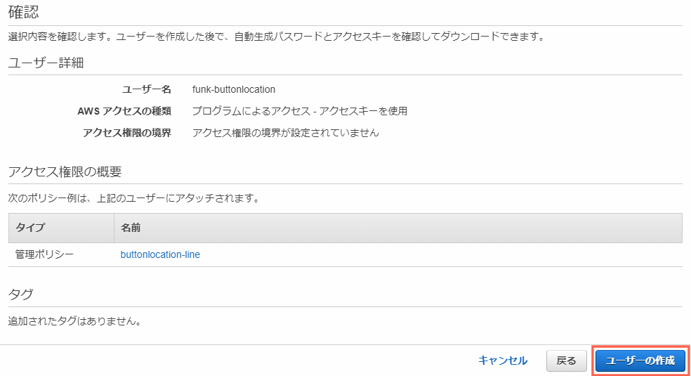

4. 作成したユーザーの アクセスキーID およびシークレットアクセスキーをコピーします。  
   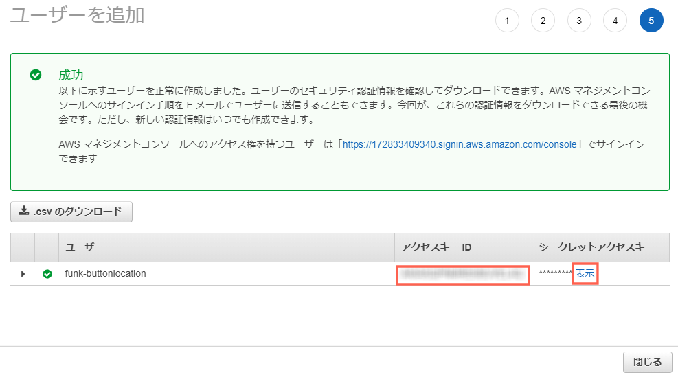


### ■ AWS IAM ユーザーの認証情報を SORACOM に登録する

1. SORACOM ユーザーコンソールの右上のユーザー名をクリックし、`セキュリティ` を選択します。  
   

2. "認証情報ストア" => "認証情報を登録" を選択します。  
   

3. "認証情報 ID" は任意に記載し、先ほどコピーした AWS ユーザーのアクセスキー ID およびシークレットアクセスキーを入力し、"登録" をクリックします。  
   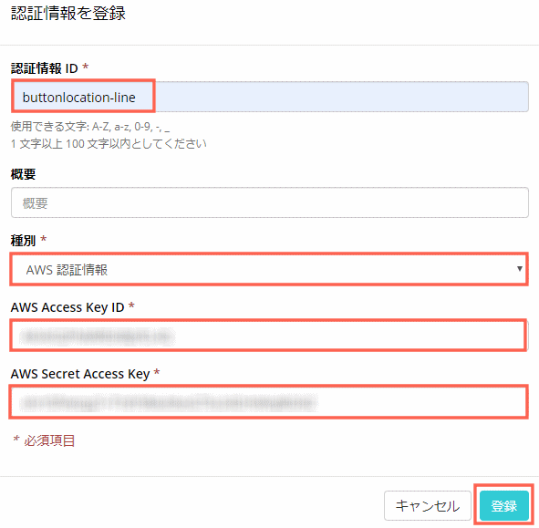

### ■ Funk を設定する

1. ユーザーコンソールの "SIM 管理" メニューより、作成した SIM のグループ名を選択します。  
   
2. "SORACOM Funk 設定" を開き、"ON" にし、先ほど登録した認証情報やコピーした Lambda の ARN を入力して "保存" をクリックします。  
   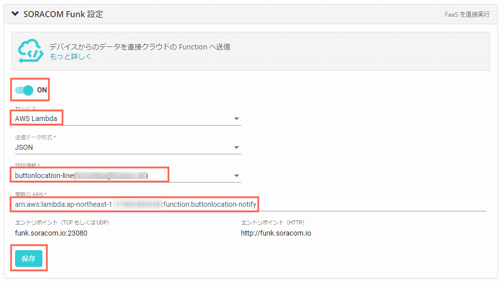

### ■ Enterprise Button を押して LINE 通知を確認する

ここまでで設定が完了しました。
ボタンを押すと、自分のスマートフォンのLINEに通知が来るはずです。
URLをクリックすると、Google Map上に位置が表示されます。
（基地局情報を基準としているため、誤差があります）

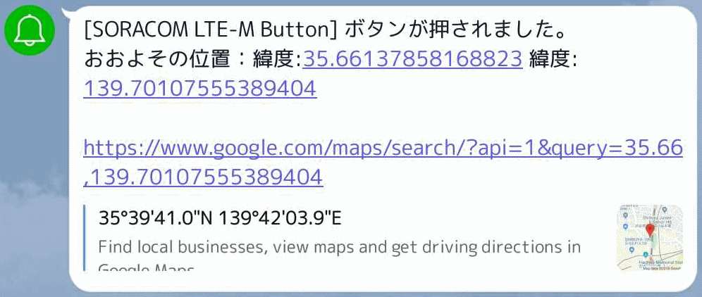

確認できない場合は、Lambda のメトリックにて「ログが出ているか」「エラーが出ていないか」を確認してください。


## サービスの解除と課金の停止(参考)

今回は貸出ボタンのため問題ありません。

簡易位置測位機能、Harvest、Funk を有効にしたグループ配下に SIM があると基本使用料金が発生します。詳細は [目安となる料金](#目安となる料金) の章をご確認さい。
これらを解約したい場合は、それぞれの機能についてグループで無効化します。

1. ユーザーコンソールの ["SIM 管理" メニュー](https://console.soracom.io/#/?coverage_type=jp)より、作成した SIM のグループ名を選択します。  
   

2. "SORACOM Funk 設定" を開き、"OFF" にし "保存" をクリックします。  
   

3. "SORACOM Harvest 設定" を開き、OFF にし "保存" をクリックします。  
   

4. "SORACOM Air for Cellular 設定" を開き、"簡易位置測位機能" および "バイナリパーサー設定" を "OFF" にし "保存" をクリックします。 5.[ユーザーコンソール](https://console.soracom.io) から 対象の SIM のチェックボックスを選択 => "操作" => "所属グループ変更" を選択します。  
   

5. "グループ解除" を選択します。  
   
