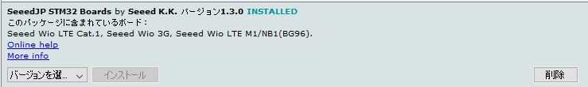

## 0. 事前にインストールしておくソフトウェア

ハンズオン当日までに[事前準備](https://soracom.github.io/jp-training/WioLTE/0/prepare)を実施ください。Windows編とMac編があります。手順中、Wio LTEの接続が必要な部分はスキップいただいて結構です。  
その後、下記を確認、実施しておいてください。

## <a name="0-1">0-1. ボードプラットフォーム</a>

**SeeedJP STM32 Boards by Seeed K.K.** は、最新バージョン（2019/11/15時点は**1.3.0**）をインストールしてください。  
ボードマネージャでインストール、アップデート可能です。

## <a name="0-2">0-2. ライブラリ</a>

### Wio LTE for Arduino by Seeed K.K.

**Wio LTE for Arduino by Seeed K.K.** は、最新バージョン（2019/11/15時点は**2.9.0**）をインストールしてください。  
ライブラリマネージャでインストール、アップデート可能です。

### GroveDriverPack by Seeed K.K.

**GroveDriverPack by Seeed K.K.** は、最新バージョン（2019/11/15時点は**1.5.0**）をインストールしてください。  
ライブラリマネージャでインストール、アップデート可能です。

### pubsubclient

**pubsubclient** は、**SeeedJPが公開しているgithubリポジトリのもの**をインストールしてください。
（ライブラリマネージャではインストールできません！！）  
**pubsubclient**のgithubリポジトリは[こちら](https://github.com/SeeedJP/pubsubclient)です。

githubリポジトリの`Download ZIP`でzipファイルをダウンロードして、Arduino IDEの`スケッチ > ライブラリをインクルード > ZIP形式のライブラリをインストール`でインストールしてください。

***
