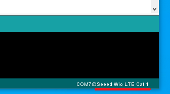
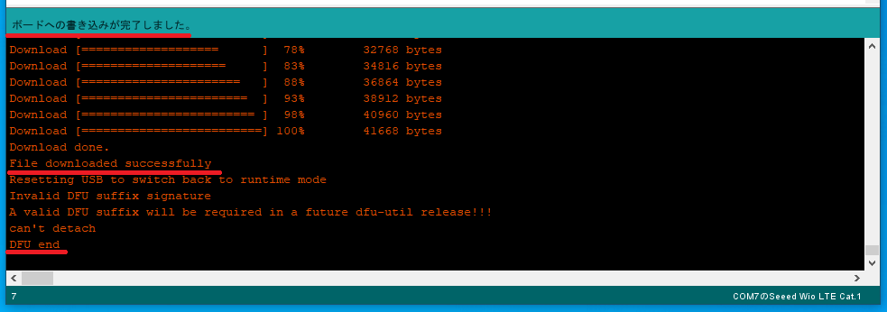
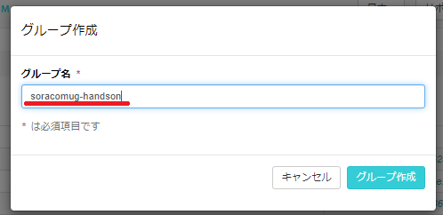
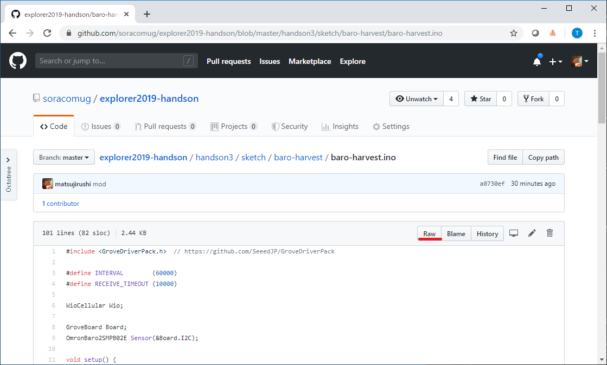
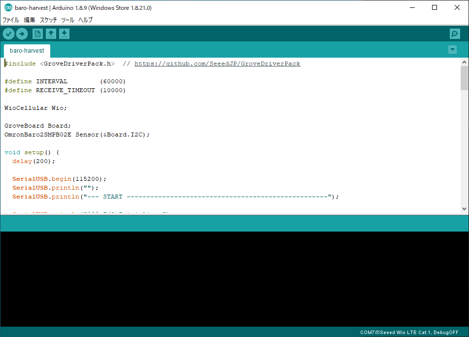
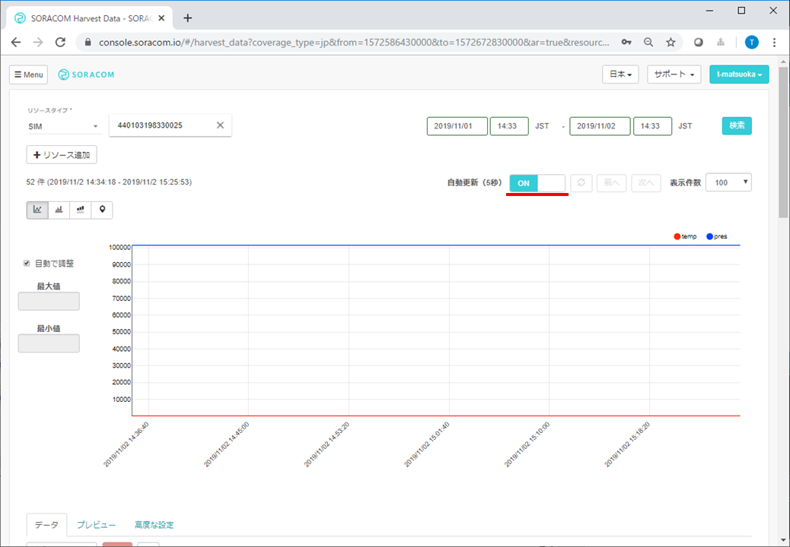

## 1. ハードウェアと開発環境の確認

### <a name="1-1">1-1. ブランクのスケッチをWio LTEに書き込んでください。</a>

Arduino IDEを起動して、`ファイル > 新規ファイル`を実行してください。  
新しいウィンドウが開いて、ブランクのスケッチが表示されます。

```cpp
void setup() {
  // put your setup code here, to run once:

}

void loop() {
  // put your main code here, to run repeatedly:

}
```

`ツール > ボード > (SeeedJP STM32 Boardsの)Seeed Wio LTE Cat.1`を選択してください。  
ウィンドウ右下に「Seeed Wio LTE Cat.1」と表示されます。



Wio LTEをパソコンにDFUモードで接続して、`スケッチ > マイコンボードに書き込む`を実行してください。  
ウインドウ下部に、「ボードへの書き込みが完了しました。」「File downloaded successfully」「DFU end」と表示されていれば成功です。



***

### <a name="1-2">1-2. Wio LTEにSIMを差してください。</a>

Wio LTEをパソコンから外して、Wio LTEにSIMを差してください。  
下の写真を参考に、表裏、差し込む箇所を間違えないように注意してください。また、差し込んだSIMは完全に覆われるところまでしっかりと差し込んでください。


***

### <a name="1-3">1-3. 絶対圧センサーをWio LTEに接続してください。</a>

Wio LTEをパソコンから外して、絶対圧センサーをGroveケーブルを使ってWio LTEのI2Cコネクタに接続してください。


***

### <a name="1-4">1-4. SIMにSIMグループを割り当ててください。</a>

SORACOMユーザーコンソールで、`Menu > SIMグループ`を選択して、`+追加`をクリックしてください。


グループ名を「soracomug-handson」にして、`グループ作成`をクリックしてください。



作成したグループが表示されれば成功です。


(TODO:SIMにSIMグループを割り当て)

***

### <a name="1-5">1-5. SIMグループにSORACOM Harvestを割り当てて、有効にしてください。</a>

「soracomug-handson」SIMグループのSORACOM Harvest設定を「ON」にして、`保存`をクリックしてください。


***

### <a name="1-6">1-6. 絶対圧をSORACOM Harvestへ送信するスケッチをWio LTEに書き込んでください。</a>

[ここ](sketch/baro-harvest/baro-harvest.ino)をクリックすると、「baro-harvest.ino」が表示されます。「Raw」を右クリックして`名前を付けてリンク先を保存`で、パソコンに保存してください。



Arduino IDEで、`ファイル > 開く`を実行して、保存した「baro-harvest.ino」を開いてください。



Wio LTEをパソコンにDFUモードで接続して、`スケッチ > マイコンボードに書き込む`を実行してください。  

***

### <a name="1-7">1-7. SORACOM Harvestに絶対圧が表示されていることを確認してください。</a>

SORACOMユーザーコンソールで、`Menu > SIM管理`を選択して、使用しているSIMの左側をチェック、`操作 > データを確認`をクリックしてください。そして、自動更新を「ON」にしてください。  
温度（temp）と圧力（pres）がグラフ表示されれば成功です。  



温度と圧力で数値が大きく違うことから、グラフ表示で値が変化していないように見えますが、凡例の「temp」「pres」をクリックして、どちらか一方だけを表示すると、値が変化していることが確認できます。


***
