## 2. ハンズオン環境構築

### <a name="2-1">2-1. SIMグループに割り当てているSORACOM Harvestを無効にしてください。</a>

SORACOMユーザーコンソールで、`Menu > SIMグループ`を選択して、「soracomug-handson」SIMグループをクリック、SORACOM Harvest設定を「OFF」にして、`保存`をクリックしてください。

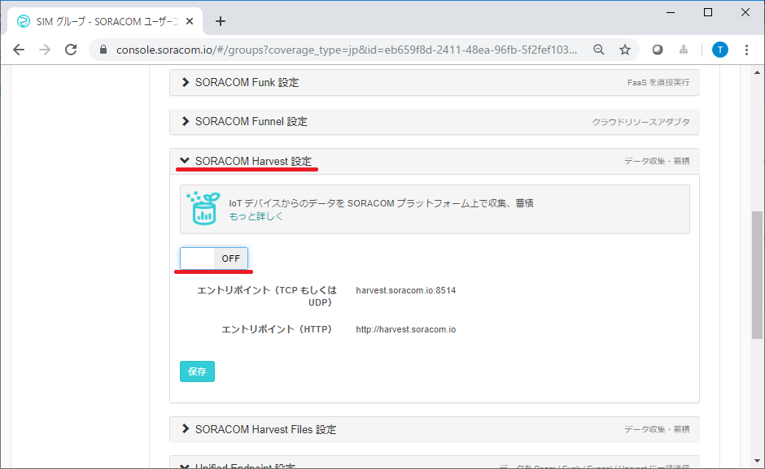

***

### <a name="2-2">2-2. AWS IoT CoreのカスタムエンドポイントとCA証明書を取得してください。</a>

AWSコンソールでIoT Coreを開き、`設定`を選択して、表示される「カスタムエンドポイント」をコピーしてください。

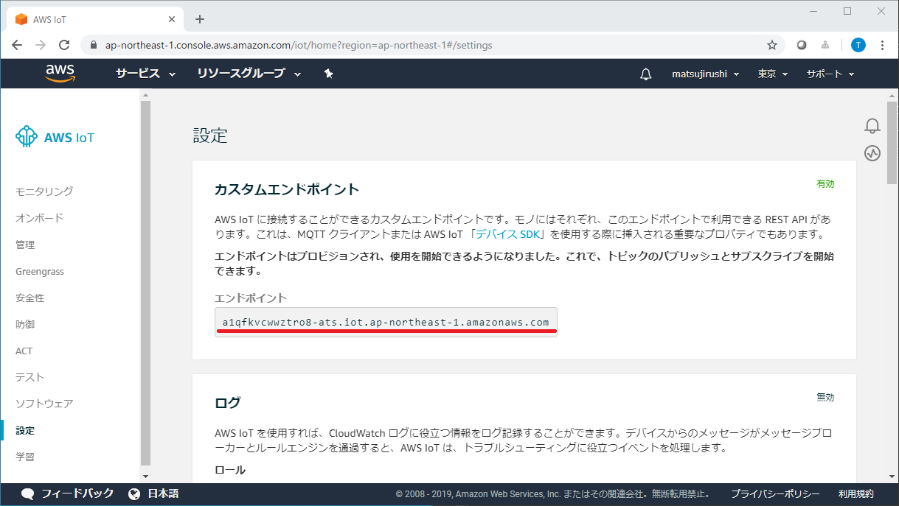

[AWS IoT開発者ガイド](https://docs.aws.amazon.com/ja_jp/iot/latest/developerguide/managing-device-certs.html#server-authentication)にある、CA証明書（RSA2048ビットキー:AmazonルートCA1）をパソコンに保存してください。

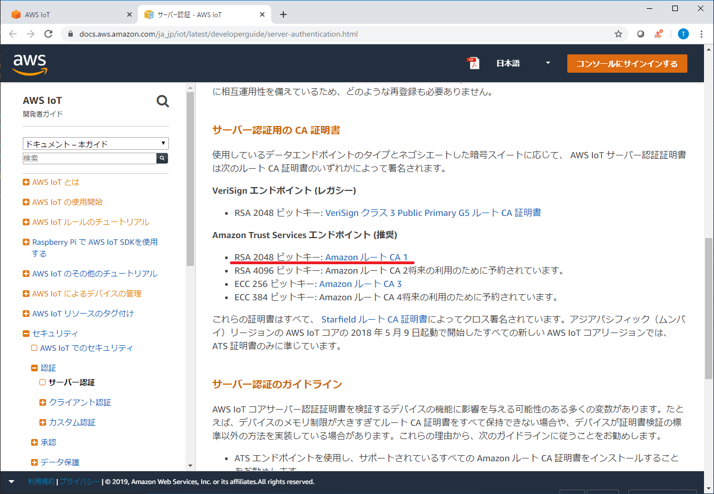

***

### <a name="2-3">2-3. AWS IoT Coreにポリシーを追加してください。</a>

AWS IoTで`安全性 > ポリシー`を選択して、「ポリシーの作成」をクリック、ポリシーを作成してください。

|項目名1|項目名2|値|
|:--|:--|:--|
|名前||AllAccessPolicy|
|ステートメント|アクション|iot:\*|
||リソースARN|\*|
||効果|許可をチェック|

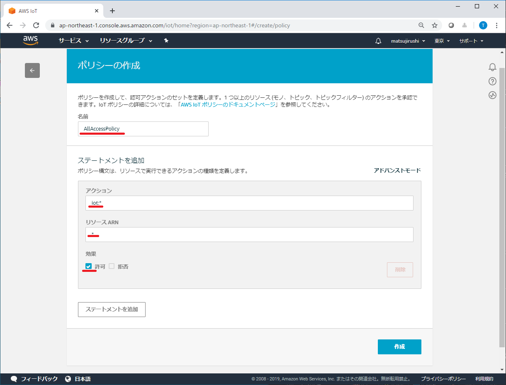

***

### <a name="2-4">2-4. AWS IoT Coreにモノを追加して、クライアント証明書とプライベートキーを取得してください。</a>

AWS IoTで`管理 > モノ`を選択して、「モノの登録」をクリック、「単一のモノを作成する」をクリック、名前を「BaroDevice1」にして「次へ」をクリックしてください。

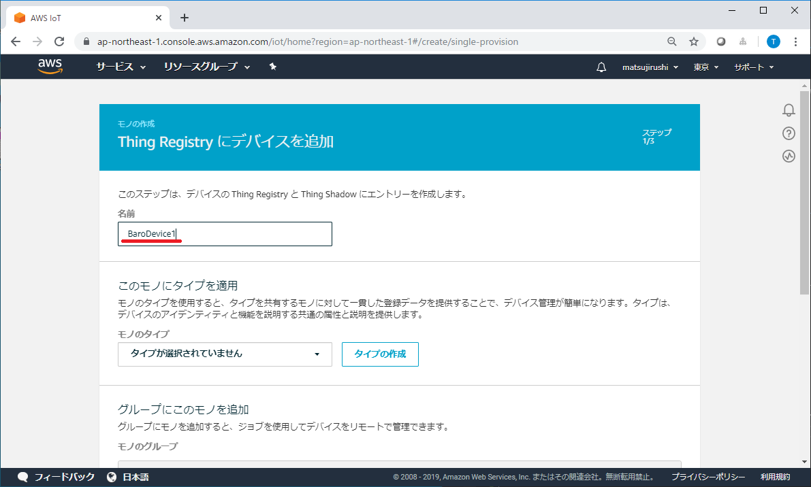

「証明書の作成」をクリックし、「このモノの証明書」（クライアント証明書）とプライベートキーをダウンロードしてください。**←後からダウンロードできないので必ず実施すること！**  
「有効化」をクリックして、「ポリシーをアタッチ」をクリックしてください。

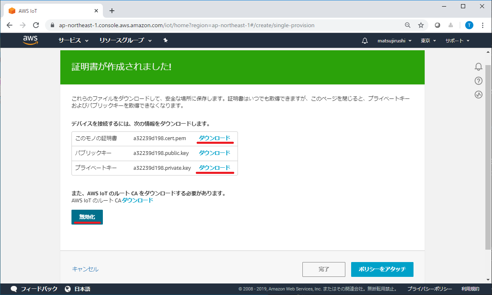

「AllAccessPolicy」をチェックして、「モノの登録」をクリックしてください。

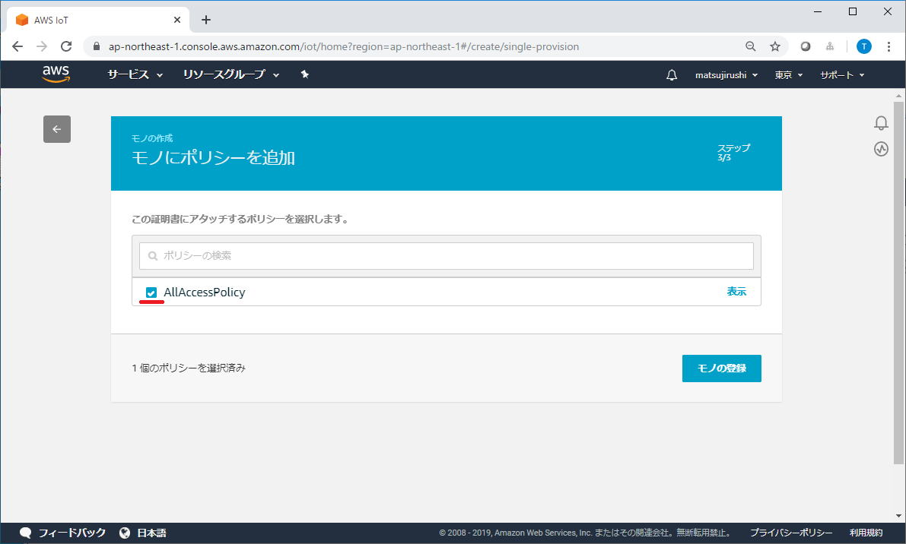

> 2-3と2-4の手順で、クライアント証明書（+プライベートキー）に、ポリシー「AllAccessPolicy」とモノ「BaroDevice1」が紐づいた状態になりました。
>
> 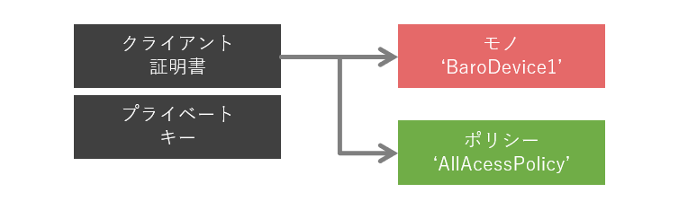

***

### <a name="2-5">2-5. SORACOM認証情報ストアに認証情報を追加してください。</a>

SORACOMユーザーコンソールで、右上のユーザー名の部分をクリックして、`セキュリティ`を選択してください。

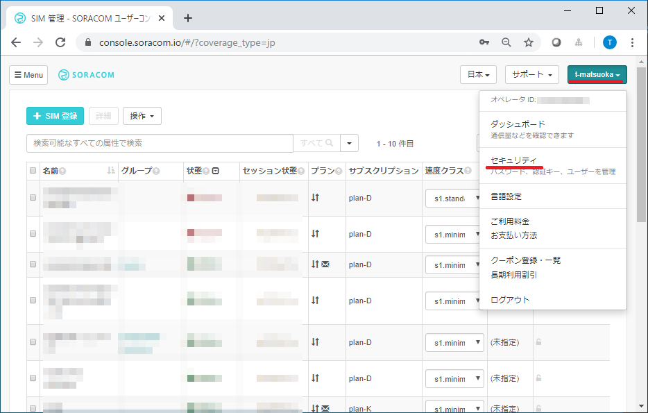

`証明書ストア`を選択して、「+認証情報を登録」をクリック、BaroDevice1の認証情報を登録してください。

|項目名|値|
|:--|:--|
|認証情報ID|BaroDevice1|
|種別|X.509証明書|
|秘密鍵|(プライベートキーの内容 xxxx-private.pem.key)|
|証明書|(クライアント証明書の内容 xxxx-certificate.pem.crt)|
|CA証明局|(CA証明書の内容 AmazonRootCA1.pem)|

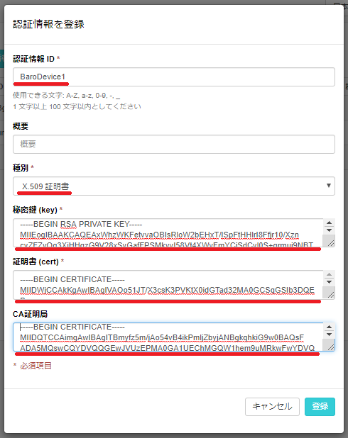

***

### <a name="2-6">2-6. SIMグループにSORACOM Beamを追加してください。</a>

SORACOMユーザーコンソールで、`Menu > SIMグループ`を選択して、「soracomug-handson」SIMグループをクリック、SORACOM Beam設定の「+」をクリックして、「MQTTエントリポイント」を追加してください。

|項目名1|項目名2|値|
|:--|:--|:--|
|設定名||BaroDevice1|
|転送先|種別|Standard MQTT broker|
||プロトコル|MQTTS|
||ホスト名|(カスタムエンドポイント)|
||証明書|ON|
||認証情報|BaroDevice1|

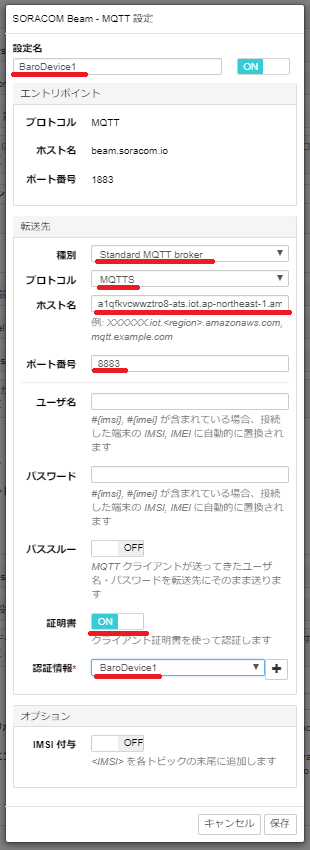

***

### <a name="2-7">2-7. 絶対圧をAWS IoT Coreへ送信するスケッチをWio LTEに書き込んでください。</a>

[baro-awsiot.ino](sketch/baro-awsiot/baro-awsiot.ino)をダウンロードして、Wio LTEに書き込み、実行してください。

***

### <a name="2-8">2-8. AWS IoT Coreに絶対圧が届いていることを確認してください。</a>

AWS IoTで`テスト`を選択して、「トピックのサブスクリプション」に「#」を入力、「トピックへのサブスクライブ」をクリックしてください。

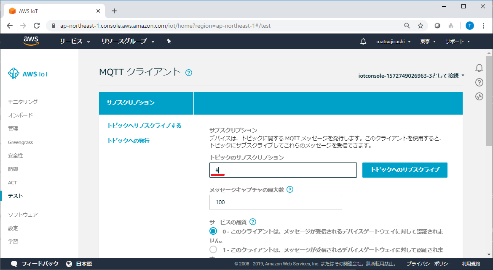

しばらくすると、ウィンドウ右下部に温度と圧力が表示されます。

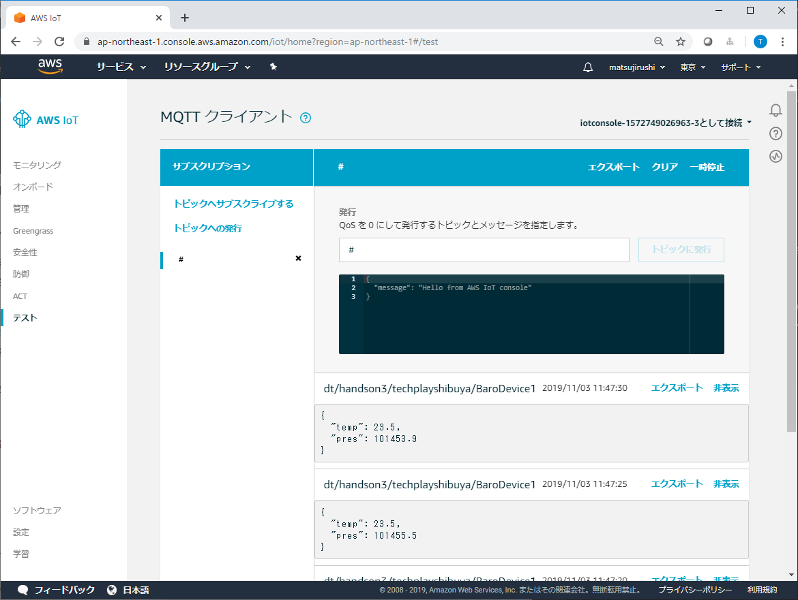

***
