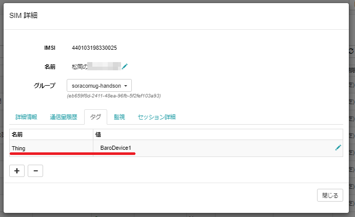
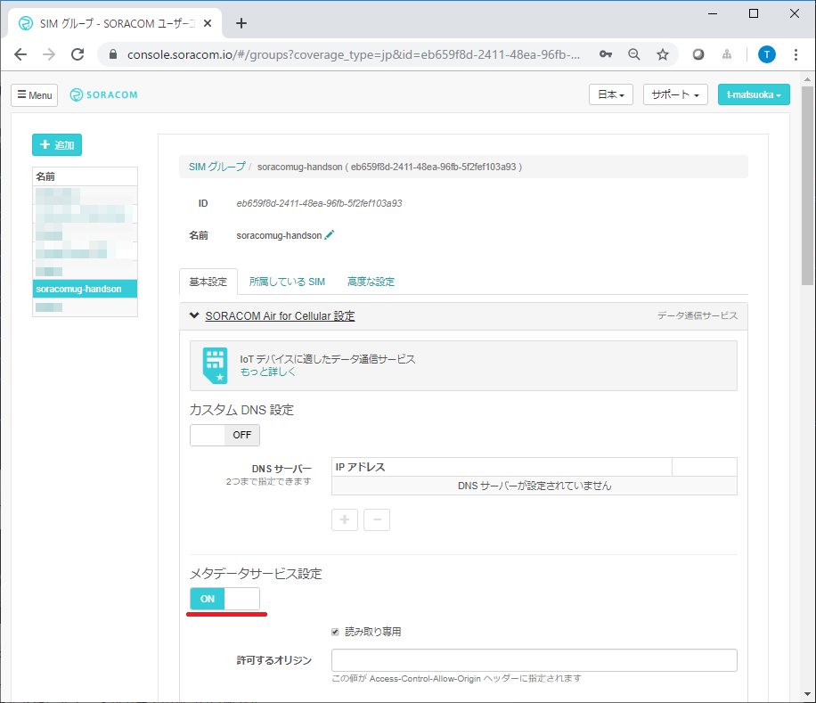
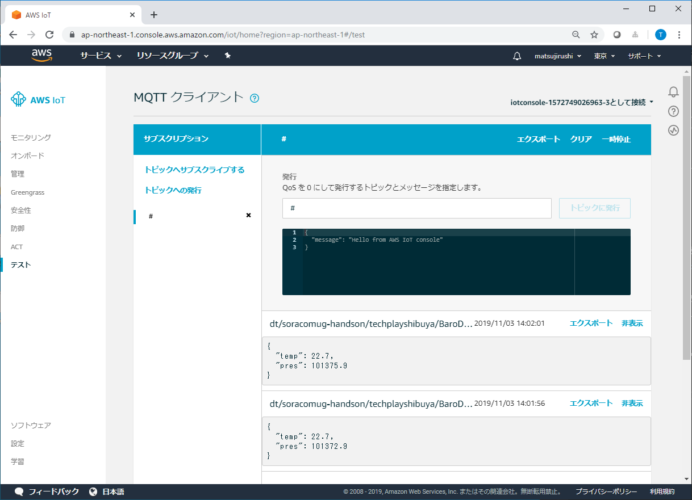

## 3. ハードコードを無くせ

### <a name="3-1">3-1. デバイスを増やしたときにスケッチを書き換えなければいけない箇所を調べてください。</a>


前の章で、絶対圧センサ+Wio LTE+SIMのデバイスからSORACOM Beamを経由してAWS IT Coreへ送信するシステムが出来上がりました。

さて、このデバイスを現場にたくさんばらまこうとすると、今のスケッチ[baro-awsiot.ino](sketch/baro-awsiot/baro-awsiot.ino)では**デバイス毎に書き換えないといけない**部分があって、1000デバイスを用意しようと思うと1000回書き換えて1000回コンパイルする、、、という苦行をしなければいけません。

以降の作業で、デバイス毎に書き換えしなくて済むようシステムを変更していきます。

今のスケッチ[baro-awsiot.ino](sketch/baro-awsiot/baro-awsiot.ino)の、都度、書き換えが必要な部分を洗い出してください。

***

### <a name="3-2">3-2. どのような方法でスケッチを書き換えないようにするか考えてください。</a>

デバイス毎の個別情報を保持、取得するサービスに、**SORACOM Air メタデータサービス**があります。

> **メタデータサービスとは**  
> 一言で言うならば、Air 経由で特殊な URL に HTTP アクセスする事で、認証なしで SIM(Subscriber) の情報を取得したり、API実行を行える、という機能です(グループ単位で機能のコントロールが可能)。  
> （[SORACOM Air メタデータサービスの紹介](https://blog.soracom.jp/blog/2015/11/27/air-metadata/)）  
> （[SORACOM Air メタデータサービス機能を使用する](https://dev.soracom.io/jp/start/metadata/)）

「モノの名前」をSIMのタグ情報としてSORACOMに登録しておき、それをスケッチで読み出して使用するように変更しましょう。

***

### <a name="3-3">3-3. SIMにモノの名前を登録してください。</a>



***

### <a name="3-4">3-4. SORACOM Air メタデータサービスを有効にしてください。</a>



***

### <a name="3-5">3-5. スケッチを修正してWio LTEに書き込んでください。</a>

SORACOM Air メタデータサービスから値を取得する関数を追加してください。（`setup()`関数の前に。）

```cpp
// Wio LTE から SORACOM Air のメタデータサービスにアクセスするコードスニペット@ma2shita
// https://qiita.com/ma2shita/items/44cfe28d76fe0d8aa45a
String get_metadata_by(WioLTE& wio, const char* tag_key, const char* default_value = "") {
    char url[1024];
    sprintf(url, "http://metadata.soracom.io/v1/subscriber.tags.%s", tag_key);
    char buf[1024];
    wio.HttpGet(url, buf, sizeof(buf));
    String content = String(buf);
    content.trim();
    if (content == "Specified key does not exist." || /* == 404 */
        content == "You are not allowed to access Metadata Server.") { /* == 403 */
        content = String(default_value);
        content.trim();
    }
    return content;
}
```

`THING`と`TELEMETRY_TOPIC`を変数にしてください。

**変更前**
```cpp
#define THING           "BaroDevice1"
#define TELEMETRY_TOPIC "dt/" APPLICATION "/" CONTEXT "/" THING
```

**変更後**
```cpp
char THING[50];
char TELEMETRY_TOPIC[200];
```

`THING`と`TELEMETRY_TOPIC`を代入するコードを追加してください。（APNに接続した後、MQTTサーバーに接続する前。）

```cpp
  SerialUSB.println("### Get thing name from meta data service.");
  strcpy(THING, get_metadata_by(Wio, "Thing").c_str());
  sprintf(TELEMETRY_TOPIC, "dt/%s/%s/%s", APPLICATION, CONTEXT, THING);
  SerialUSB.print("Thing = ");
  SerialUSB.println(THING);
```

> 変更後の完全なコードは[こちら](sketch/baro-awsiot2/baro-awsiot2.ino)。

***

### <a name="3-6">3-6. AWS IoT Coreに絶対圧が届いていることを確認してください。</a>



***
