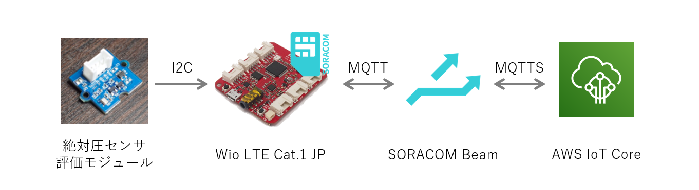
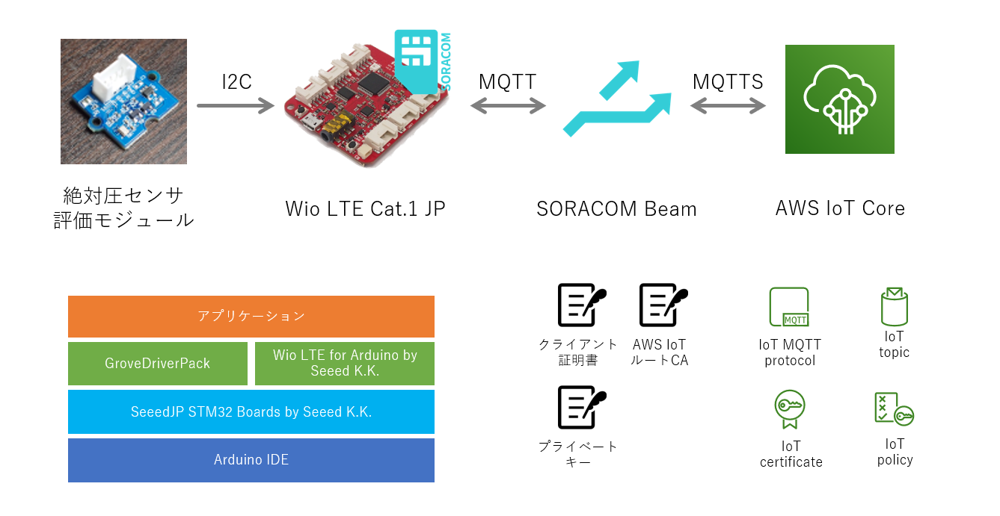
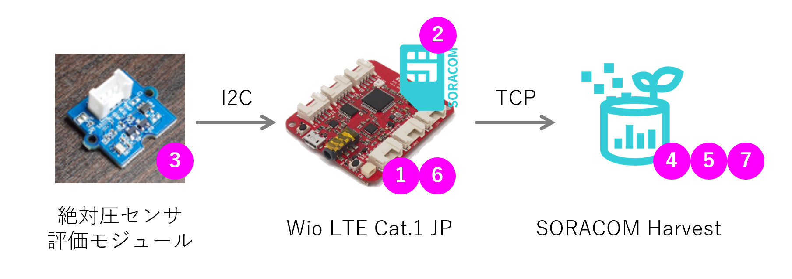

### ハンズオン案内

**【中級】Wio LTEとオムロン絶対圧センサーを用いたIoT開発ハンズオン**

「センサー値がインターネットにアップできた！」の次に考えなければいけない、IoTデバイスが増えてきたときにやるべき処方をハンズオン形式で学びます。  

* 絶対圧センサー+Wio LTE（IoTデバイス）の測定値を、AWS IoT Coreへ送るシステムを構築
* IoTデバイスを増産するときの作業を考察
* 手間を減らす方法と、その実装

> **注意事項**  
> 本ハンズオンは、**中級**です。Wio LTEの開発経験ならびに開発環境が整っている方を対象にしています。  
> 環境やスキルによっては時間内に終わらないかもしれません。ご了承ください。  
> （[IoT.kyotoハンズオン記事](https://iot.kyoto/integration_case/2019/04/13/3739/)のステップ3まで出来るスキルの保有を想定しています。）

***

### 本ハンズオンの流れ

1. (15min.) ハードウェアと開発環境の確認
2. (30min.) ハンズオン環境構築  
3. (30min.) ハードコードを無くせ  
4. (30min.) SIMグループ増殖を防ぐ  
5. (Appendix A) データ送信周期をクラウドから変更  
6. (Appendix B) デバイス未接続に対処  

***

## 1. ハードウェアと開発環境の確認

絶対圧センサーの値をSORACOM Harvestでグラフ表示することで、ハードウェア・SIM・SORACOMアカウントが問題なく使用できることを確認します。

1. [[詳細](1.md#1-1)] **ブランクのスケッチ**を**Wio LTE**に書き込んでください。
2. [[詳細](1.md#1-2)] **Wio LTE**に**SIM**を差してください。
3. [[詳細](1.md#1-3)] **絶対圧センサー**を**Wio LTE**に接続してください。
4. [[詳細](1.md#1-4)] **SIM**に**SIMグループ**を割り当ててください。
5. [[詳細](1.md#1-5)] **SIMグループ**に**SORACOM Harvest**を割り当てて、有効にしてください。
6. [[詳細](1.md#1-6)] **絶対圧をSORACOM Harvestへ送信するスケッチ**を**Wio LTE**に書き込んでください。
7. [[詳細](1.md#1-7)] **SORACOM Harvest**に絶対圧が表示されていることを確認してください。

## 2. ハンズオン環境構築

絶対圧をAWSのクラウドサービスで処理できるように、AWS IoT Coreへ送信します。

1. **SIMグループ**に割り当てている**SORACOM Harvest**を無効にしてください。
2. **AWS IoT Core**の(接続情報)を取得してください。
3. **AWS IoT Core**に(ポリシー)を追加してください。
4. **AWS IoT Core**に(Thing)を追加して、**クライアント証明書**と**プライベートキー**を取得してください。
5. **SIMグループ**に**SORACOM Beam**を追加してください。
6. **絶対圧をAWS IoT Coreへ送信するスケッチ**を**Wio LTE**に書き込んでください。
7. **AWS IoT Core**に絶対圧が届いていることを確認してください。

## 3. ハードコードを無くせ

## 4. SIMグループ増殖を防ぐ
