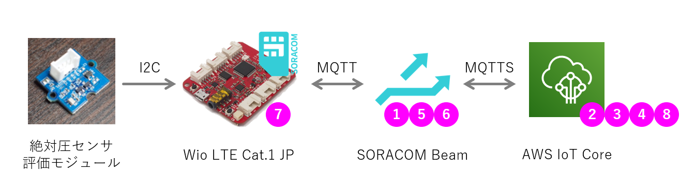

# 【中級】Wio LTEとオムロン絶対圧センサーを用いたIoT開発ハンズオン

## 目次

0. (--min.) 事前にインストールしておくソフトウェア
1. (15min.) ハードウェアと開発環境の確認
2. (30min.) ハンズオン環境構築
3. (30min.) ハードコードを無くせ
4. (30min.) SIMグループ増殖を防ぐ

***

## 0. 事前にインストールしておくソフトウェア

1. [詳細](0.md#0-1) ボードプラットフォーム
2. [詳細](0.md#0-2) ライブラリ

## 1. ハードウェアと開発環境の確認

絶対圧センサーの値をSORACOM Harvestでグラフ表示することで、ハードウェア・SIM・SORACOMアカウントが問題なく使用できることを確認します。

1. [[詳細](1.md#1-1)] **ブランクのスケッチ**を**Wio LTE**に書き込んでください。
2. [[詳細](1.md#1-2)] **Wio LTE**に**SIM**を差してください。
3. [[詳細](1.md#1-3)] **絶対圧センサー**を**Wio LTE**に接続してください。
4. [[詳細](1.md#1-4)] **SIM**に**SIMグループ**を割り当ててください。
5. [[詳細](1.md#1-5)] **SIMグループ**に**SORACOM Harvest**を割り当てて、有効にしてください。
6. [[詳細](1.md#1-6)] **絶対圧をSORACOM Harvestへ送信するスケッチ**を**Wio LTE**に書き込んでください。
7. [[詳細](1.md#1-7)] **SORACOM Harvest**に絶対圧が表示されていることを確認してください。

## 2. ハンズオン環境構築

絶対圧をAWSのクラウドサービスで処理できるように、AWS IoT Coreへ送信します。

1. [[詳細](2.md#2-1)] **SIMグループ**に割り当てている**SORACOM Harvest**を無効にしてください。
2. [[詳細](2.md#2-2)] **AWS IoT Core**の**カスタムエンドポイント**と**CA証明書**を取得してください。
3. [[詳細](2.md#2-3)] **AWS IoT Core**に**ポリシー**を追加してください。
4. [[詳細](2.md#2-4)] **AWS IoT Core**に**モノ**を追加して、**クライアント証明書**と**プライベートキー**を取得してください。
5. [[詳細](2.md#2-5)] **SORACOM認証情報ストア**に**認証情報**を追加してください。
6. [[詳細](2.md#2-6)] **SIMグループ**に**SORACOM Beam**を追加してください。
7. [[詳細](2.md#2-7)] **絶対圧をAWS IoT Coreへ送信するスケッチ**を**Wio LTE**に書き込んでください。
8. [[詳細](2.md#2-8)] **AWS IoT Core**に絶対圧が届いていることを確認してください。

## 3. ハードコードを無くせ

1. [[詳細](3.md#3-1)] デバイスを増やしたときに**スケッチ**を書き換えなければいけない箇所を調べてください。
2. [[詳細](3.md#3-2)] どのような方法で**スケッチ**を書き換えないようにするか考えてください。
3. [[詳細](3.md#3-3)] **SIM**に**モノの名前**を登録してください。
4. [[詳細](3.md#3-4)] **SORACOM Air メタデータサービス**を有効にしてください。
5. [[詳細](3.md#3-5)] **スケッチ**を修正して**Wio LTE**に書き込んでください。
6. [[詳細](3.md#3-6)] **AWS IoT Core**に絶対圧が届いていることを確認してください。

## 4. SIMグループ増殖を防ぐ

1. [[詳細](4.md#4-1)] デバイスを増やしたときに追加しなければいけない**SORACOMの設定**を調べてください。
2. [[詳細](4.md#4-2)] **SIMグループ**を増やさなくても済む方法を考えてください。
3. [[詳細](4.md#4-3)] **SIMグループの設定**をAPIで取得してください。
4. [[詳細](4.md#4-4)] **SORACOM Beamの設定**を切り出して、**クレデンシャルID**を変更してください。
5. [[詳細](4.md#4-5)] **SIMグループ**に**変更したSORACOM Beamの設定**を設定してください。
6. [[詳細](4.md#4-6)] **SORACOM認証情報ストア**に**認証情報**を追加してください。
7. [[詳細](4.md#4-7)] **Wio LTE**を動かしてください。
8. [[詳細](4.md#4-8)] **AWS IoT Core**に絶対圧が届いていることを確認してください。
